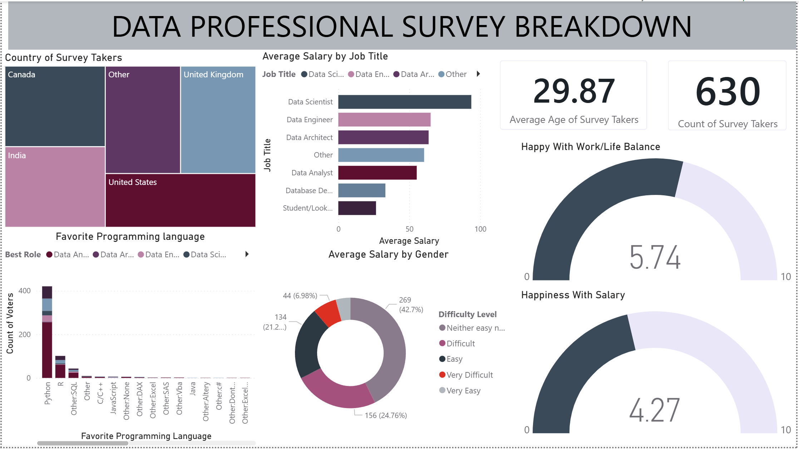

# 📊 Project Title: Data-Professional-Survey-Dashboard

## 📝 Executive Summary
This project visualizes demographics, career satisfaction, and technical preferences using Power BI.
The goal was to create an interactive dashboard.

## 📂 Project Structure
* Dashboard File: `Final Project - Data Professional Survey.pbix`
* Data Source: `Raw Data - Power BI.xlsx` 
* Visuals: Screenshots located in this README. 

## 🖼️ Dashboard Preview

## 🛠️ Key Steps Taken
1. **Data Cleaning:** Used Power Query to clean raw survey responses, which involved handling null values in the "Salary" and "Age" columns, standardizing "Job Titles," and grouping various niche programming languages into an "Other" category for better visualization.
2. **Data Modeling:** Structured the survey data into a clean, flat table , ensuring that "Country" and "Job Title" fields were correctly categorized to allow for cross-filtering across the entire report.
3. **DAX Measures:** Developed custom DAX measures to calculate the core metrics shown in the cards and gauges, such as Average Age = AVERAGE(Survey[Age]), Total Respondents = COUNTROWS(Survey), and Average Happiness = AVERAGE(Survey[HappinessScore]).
4. **Visualization:** Built an interactive layout using a Tree Map for geographic distribution, Gauge Charts for sentiment tracking (Work/Life Balance vs. Salary), and Horizontal Bar Charts to rank average salaries by role. 

## How to Run! : 
If you want to run these files, you will need to change the source path to wherever you save the Excel file on you computer.
